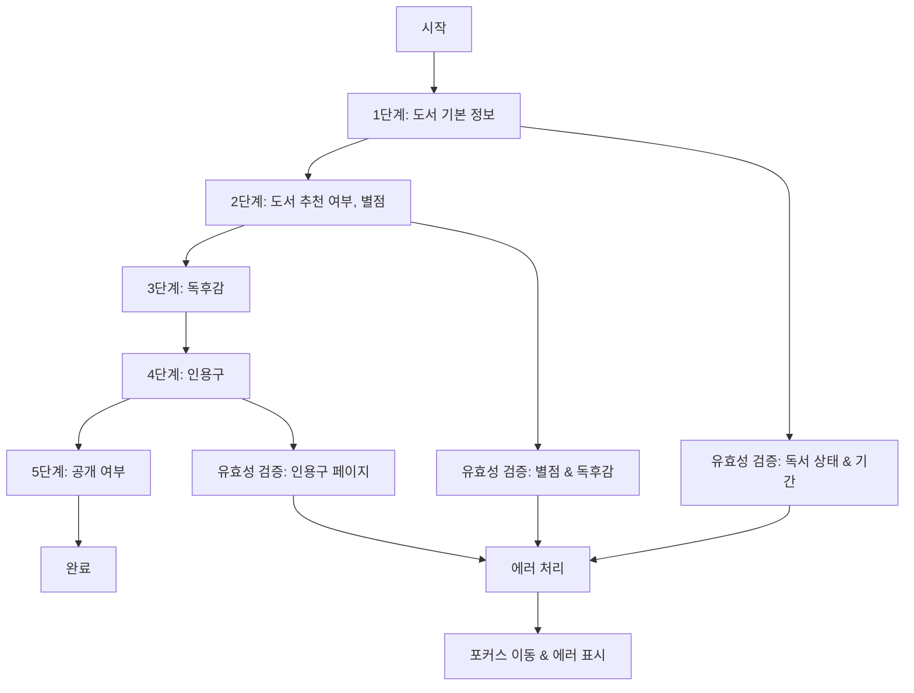

# Multi Step Form

## 0. Stack
- TypeScript
- Next.js - Page Router
- React
- React-Query
- React-Hook-Form
- Emotion
- Jotai

## 1. Flow Chart

## 2. 명세 상세 분석

명세 보기

    
### 0단계.

- **새로고침 후 폼상태를 유지**
    - 상태로 관리해선 안된다. 명세에선 쿼리 파라미터를 주었지만, 웹 스토리지를 사용하는 방법도 가능
    - 웹 스토리지를 사용한다면 스토리지 관련 커스텀 훅/함수를 만드는 것과 jotai persist 옵션 쪽으로 위임해서 하는 것 고민 필요. jotai(persist)를 사용하면 선언적으로 사용할 순 있지만, 라이브러리에 의존성이 생긴다. 전역 상태를 어짜피 jotai로 관리하고 있다면 의존성 문제는 해결될 수 있음.
- **유효성 검사**
    - 유효성 검증을 각 단계에서 하는 것과 마지막 단계에서 하는 것. 어떤 차이가 있을지 고민
        - 각 단계에서 할 때
        - 마지막 단계에서 할 때
    
    - 유효성 검증 메세지는 어떻게 보여줄지 고민
- **폼 정보 실시간 미리보기 앱 화면 섹션**
    - 500ms 디바운싱 적용 필요
        - 변경 상태가 많거나 무거워 진다면? 400ms 쯤에 사용자가 뭔가 입력한다면?
    - provider와 같이 앱 전체를 감싸서 상태 변화를 감지할 수 있을지 확인 필요
    - window size event를 수신해서 앱 화면 섹션을 컨디셔널 렌더링
- **재사용 컴포넌트**
    - CommaSeparatedInput 컴포넌트
        - rhf 로 맵핑 및 exprt해 재사용
        - 유저는 숫자만 입력. 숫자를 연달아 입력하면 자동으로 1000단위 콤마 삽입. 사용하는 곳에선 value를 number로 받을 수 있어야 한다.
            
            → 내부적으로는 string으로 관리하되, 
            
        - rhf로 래핑했기 때문에 여러 곳에서 register를 따로 하지 않고도 재활용 할 수 있다.
            
            → RHFCommaSeparatedInput
            
- **API, Suspense**
    - 내부적으로 Suspense를 일으키는 목록 api의 응답 값으로 AutoComplete.tsx의 Option 목록을 구성하는 컴포넌트 만들기 + rhf 화
        - 목록을 보여줄 간단한 api가 있으면 좋을 것 같다. api route나 msw를 이용해 간단한 api를 만들어 사용?
        - AutoComplete는 api의 응답으로 들어오는 책 목록을 검색하는 컴포넌트로 추정
        - Suspense나 useSuspenseQuery 등을 사용해서 처리
        - AutoComplete.tsx를 register() 없이 RHF와 연결
    - api 가 resolve되지 않았을 때는 로딩바를 보여주고, 에러가 났을 때는 rejectedFallback 컴포넌트와 서버의 에러 메시지를 함께 표시, 정상 케이스에서 resolve됐을 때 AutoComplete 노출

### 1단계.

- 도서 기본 정보
- 독서 상태
- 독서할 시작일 및 종료일

시작/종료일 여부 (조건부 렌더링)

- 독서 상태에 따라 시작/종료일 컴포넌트를 조건부 렌더링한다.
    - 읽고 싶은 책 → 렌더링 x
    - 읽는 중 → 독서 시작일만 렌더링 O, 종료일은 렌더링 x
    - 읽음 → 독서 시작일과 종료일 모두 렌더링 O
    - 보류 중 → 독서 시작일만 렌더링 O

독서 기간 설정 (유효성 검증)

- 독서 시작일은 독서 종료일보다 이후면 안된다. (Date 비교 → 유효성 에러)
- 독서 시작일은 도서 출판일 이후여야 한다.
    
    → 출판일 state나 값을 시작/종료일 컴포넌트에서 props 또는 전역 상태로 접근 가능해야 한다.
    

### 2단계.

- 도서 추천 여부
- 별점

별점

- 별점은 0.5점 스케일로, 0~5까지 나타낼 수 있다.
- 별점 1점 / 5점의 경우, 최소 100자 이상의 뒷받침 의견 컴포넌트가 필요(독후감)
- 별점 2점~4점은 선택 사항으로 입력 가능(입력 불가능이 아니다.)

### 3단계.

- 독후감

독후감

- 2단계의 별점이 2~4점이면 입력

### 4단계.

- 인용구

인용구

- 인용구 페이지 번호는 도서 전체 페이지 수보다 작아야 한다. (page 수 비교 → 유효성 에러)
- 인용구를 여러개 등록하고 지울 수 있다. (useFieldArray)
- 인용구가 두 개 이상일 때는 모든 인용구 필드 하단에 페이지 번호를 입력하는 인풋이 추가된다.
    - 유효성 검사 : 페이지 번호는 문자가 오면 안되고(숫자만), 책 페이지 수보다 작아야 한다.
    - 인용구가 두 개 이상일 때는 모든 페이지 번호 인풋은 required이고, 한 개 이하일 때는 optional이다.

### 5단계.

- 공개 여부

공개여부

- 공개(public), 비공개(private)로 설정 가능해야 한다.

## 3. etc.

- RHF와 emotion에 익숙하지 않으므로 최대한 공식문서 내용을 기반으로 개발한다.
- emotion은 CSS prop 방식과 Styled Componets 방식 중 CSS prop 방식을 사용한다. [링크](https://toss.oopy.io/cc9367e4-4ff6-4241-8189-9f3cf250f5d2#8a5bf6e1-4d2f-4c9c-836b-13154d5e200a)의 글에서 CSS prop 방식을 적극 사용한다고 한다.
